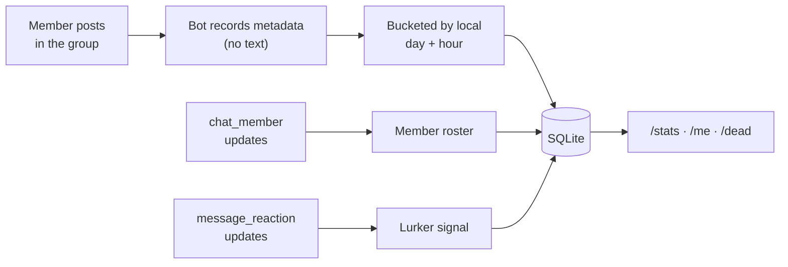

<div align="center">

# 👻 Dead Souls

**Add the bot to your private Telegram group and see exactly who talks, who lurks, and who has quietly vanished.**

A lightweight Node.js bot that tracks per-member messaging activity — messages per week, last-seen times, posting streaks, hour-of-day patterns — and surfaces the members who have gone silent. Records **message metadata only, never message text**.

[](https://nodejs.org)
[](https://www.typescriptlang.org)
[](https://grammy.dev)
[](https://github.com/WiseLibs/better-sqlite3)
[](https://core.telegram.org/bots/api)


**🌐 Language:** **English** · [Українська](README.uk.md)

</div>

---

## 📖 Table of Contents

- [Highlights](#-highlights)
- [Features](#-features)
- [How It Works](#-how-it-works)
- [Bot Commands](#-bot-commands)
- [Settings Menu](#️-settings-menu)
- [Configuration](#️-configuration)
- [Platform Limits](#-platform-limits)
- [Tech Stack](#-tech-stack)
- [Project Layout](#-project-layout)
- [Getting Started](#-getting-started)
- [License](#-license)

---

## ⭐ Highlights

|  | |
|---|---|
| 👻 **Finds the dead souls** | Lists members who stopped posting, split by *never posted*, *silent*, and *lurking*. |
| 🇺🇦 **Ukrainian by default** | Full UK/EN interface with correct three-form Ukrainian plurals. Switchable per group. |
| 🔒 **Text is never stored** | Every statistic comes from metadata alone — timestamps, author, message type. |
| 📈 **Weekly rhythm** | Messages per week, active days, current streak, and a daily sparkline. |
| 🕒 **Hour-of-day charts** | See when the group — or one person — is actually awake. |
| 👀 **Reactions count too** | Distinguishes a silent reader who reacts from someone genuinely gone. |
| ⚙️ **Inline admin menu** | Language and quiet threshold configurable from buttons, no redeploy. |

---

## ✨ Features

<details open>
<summary><b>Activity statistics</b></summary>

- **Group overview** — total messages, distinct posters, average message length, and a daily sparkline over the period.
- **Leaderboard** — ranked by message count, with messages-per-day and active-day counts.
- **Personal profile** — messages, per-week rate, active days, current streak, average length, busiest hour, reactions given and received, plus rank within the group.
- **Flexible periods** — `week` (default), `month`, `year`, `all`, or any number of days.
- **Media breakdown** — how much of someone's output is text, photos, stickers, voice notes, and so on.
- **Hour-of-day histogram** — for the whole group or a single member.
- **Bot commands never inflate counts** — they are recorded as presence but excluded from every statistic.

</details>

<details>
<summary><b>Finding inactive members</b></summary>

- **Three kinds of quiet** — `/dead` separates members who *never posted*, who *posted then went silent*, and who *lurk* (react but do not write).
- **Reaction tracking** — a member with zero messages and plenty of reactions is still reading; the bot says so instead of writing them off.
- **Configurable threshold** — set the quiet window per group from the settings menu, or pass it inline as `/dead 30`.
- **Honest coverage reporting** — the bot compares what it knows against the real member count and states plainly when its list is a lower bound.

</details>

<details>
<summary><b>Localisation</b></summary>

- **Ukrainian and English**, Ukrainian being the default.
- **Correct Ukrainian plurals** — three forms (`1 день` · `2 дні` · `5 днів`), including the 11–14 exception, with adjective agreement (`останній 21 день`).
- **Per-group language** — one group can run in Ukrainian while another runs in English, from the same instance.
- **Localised command list** — Telegram shows the command menu in the user's own client language.
- **Build-enforced completeness** — the English dictionary is typed against the Ukrainian one, so a missing translation fails compilation rather than shipping.

</details>

<details>
<summary><b>Privacy & data handling</b></summary>

- **No message text is ever written to disk.** Only timestamp, author, type, length, and reply target.
- **`/forget`** erases everything recorded about you in that chat; admins can erase another member by replying to them.
- **Local SQLite file** — no external service, nothing leaves your machine.
- **Chat allowlist** — restrict the bot to specific chat ids with `ALLOWED_CHAT_IDS`.

</details>

---

## 🧠 How It Works



1. **A message arrives.** The bot stores its timestamp, author, type, length, and reply target — never the text. Service messages and bot commands are classified separately so they never pollute the statistics.
2. **It is bucketed** into a local calendar day and hour using the configured timezone, at insert time.
3. **Membership is tracked** from `chat_member` updates, which is how the roster of who is actually in the chat gets built.
4. **Reactions are recorded** so a silent reader can be told apart from an absent member.
5. **Commands query** the indexed tables directly and render monospace tables, sparklines, and bar charts.

---

## 💬 Bot Commands

### 👤 Everyone

| Command | Description |
|---------|-------------|
| `/stats [period]` | Group overview: totals, daily sparkline, and the top 10. |
| `/top [period]` | Full leaderboard, up to 25 members. |
| `/me [@user] [period]` | Detailed profile — reply to a message to target its author. |
| `/last [@user]` | When that person last posted. |
| `/when [@user] [period]` | Hour-of-day activity histogram. |
| `/dead [days]` | Members who have gone quiet. |
| `/status` | What the bot can currently see. |
| `/forget` | Erase your own recorded data in this chat. |
| `/help` | Show all commands. |

`period` = `week` (default) · `month` · `year` · `all` · any number of days.

### 🔐 Group administrators

| Command | Description |
|---------|-------------|
| `/settings` | Open the inline settings menu. |
| `/lang uk\|en` | Text shortcut for switching language. |

---

## ⚙️ Settings Menu

Send `/settings` in the group. Only group administrators (or user ids listed in
`ADMIN_USER_IDS`) may open it, and **every button press re-checks permission** —
the menu cannot be hijacked by another member tapping the buttons.

```
⚙️ Settings
These apply to this group only.

┌────────────────────────────────┐
│ 🌐 Language: Українська        │
├────────────────────────────────┤
│ 👻 Quiet threshold: 14 days    │
├────────────────────────────────┤
│ ✖️ Close                       │
└────────────────────────────────┘
```

| Setting | Options | Falls back to |
|---------|---------|---------------|
| 🌐 **Language** | Українська · English | `DEFAULT_LANG` |
| 👻 **Quiet threshold** | 7 · 14 · 30 · 60 · 90 days | `DEAD_AFTER_DAYS` |

Overrides are stored per chat, so one instance can serve groups in different
languages with different thresholds.

---

## ⚙️ Configuration

Only `BOT_TOKEN` is required; everything else has a sensible default.

```env
BOT_TOKEN=123456:ABC-DEF...      # Required — from @BotFather

DEFAULT_LANG=uk                  # uk | en
TZ_NAME=Europe/Kyiv              # IANA timezone for day/hour bucketing
DEAD_AFTER_DAYS=14               # Quiet threshold for /dead
DB_PATH=./data/dead_souls.db     # SQLite location

ALLOWED_CHAT_IDS=                # Optional allowlist, comma-separated
ADMIN_USER_IDS=                  # Optional global admins, comma-separated
```

> **Note:** `TZ_NAME` is applied when a message is recorded. Changing it later
> affects new messages only — existing rows keep their original day and hour.

---

## 🚧 Platform Limits

These are Telegram Bot API restrictions, not gaps in the implementation. The bot
reports them honestly rather than pretending they do not exist.

| Limit | Consequence |
|-------|-------------|
| **No message history** | A bot receives messages only from the moment it joins. There is no backfill API — day one of the bot is day one of the data. |
| **No member enumeration** | Nothing in the API lists all members. The roster is built over time from `chat_member` updates plus anyone who posts or reacts. A member who joined before the bot and has never posted is **invisible**, so `/dead` is a lower bound and says so. |
| **No delete notifications** | Counts mean "messages sent", not "messages still present". Edits *are* tracked. |
| **Anonymous admins** | They post as the group, not as a user, so their messages are excluded from per-user statistics. |

---

## 🧰 Tech Stack

| Dependency | Purpose |
|------------|---------|
| **grammY** | Telegram Bot API framework, first-class TypeScript |
| **better-sqlite3** | Embedded SQLite, synchronous and fast |
| **dotenv** | Environment configuration |
| **tsx** | Watch-mode development runner |

> Requires **Node.js 20+**. Written in TypeScript with `strict` and
> `noUncheckedIndexedAccess` enabled.

---

## 📁 Project Layout

```
src/
├─ index.ts             # Entry point — allowed_updates, command registration
├─ config.ts            # Environment parsing & validation
├─ settings.ts          # Per-chat overrides with an in-memory cache
├─ time.ts              # Timezone-aware day/hour bucketing
├─ format.ts            # Monospace tables, sparklines, bar charts
├─ i18n/
│  ├─ uk.ts             # Ukrainian — the reference locale
│  ├─ en.ts             # English, typed against uk.ts
│  ├─ plural.ts         # Three-form Ukrainian pluralisation
│  └─ index.ts          # Locale resolution per chat
├─ db/
│  ├─ schema.ts         # Table definitions
│  ├─ migrate.ts        # Adds columns missing from older databases
│  └─ queries.ts        # Every SQL statement, prepared once
├─ handlers/            # Message, membership and reaction recording
└─ commands/            # stats · profile · dead · settings · misc
scripts/
└─ smoke.ts             # 69 assertions over synthetic traffic
```

**Database & migrations:** SQLite in WAL mode. On startup the bot creates any
missing tables and adds any missing columns, so upgrading never requires
deleting the database file.

---

## 🚀 Getting Started

### 1. Create the bot

In [@BotFather](https://t.me/BotFather):

1. `/newbot` → copy the token.
2. **`/setprivacy` → select your bot → `Disable`.**

> ⚠️ **Step 2 is not optional.** With privacy mode on, a bot in a group receives
> only commands and replies addressed to it — you would record almost nothing.

### 2. Install and run

```bash
# 1. Install dependencies
npm install

# 2. Add your bot token
cp .env.example .env    # then edit BOT_TOKEN and TZ_NAME

# 3. Build and start
npm run build
npm start
```

Development mode: `npm run dev` · Verify the query layer: `npm run smoke`

### 3. Add to your group

1. Add the bot to the group.
2. **Promote it to administrator.** Admin rights are required for `chat_member`
   and `message_reaction` updates — without them the bot cannot build a member
   roster or detect lurkers. No other permissions are needed.
3. If the bot was added *before* you disabled privacy mode, **remove and re-add
   it** — the setting is applied when the bot joins.

Run `/status` in the group to confirm everything is wired up correctly.

---

## 📜 License

Released under the **MIT** License.
