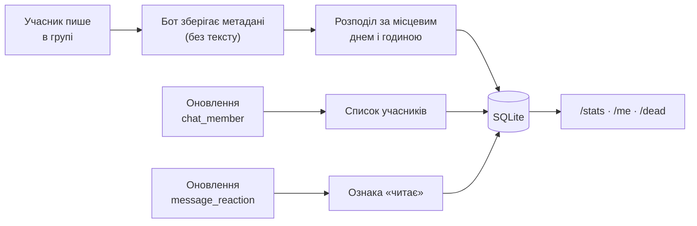

<div align="center">

# 👻 Dead Souls

**Додайте бота до приватної групи в Telegram і побачте, хто спілкується, хто лише читає, а хто тихо зник.**

Легкий Node.js бот, який веде статистику активності кожного учасника — повідомлень на тиждень, коли писали востаннє, серії днів поспіль, розподіл за годинами доби — і показує тих, хто замовк. Зберігає **лише метадані повідомлень, ніколи не текст**.

[](https://nodejs.org)
[](https://www.typescriptlang.org)
[](https://grammy.dev)
[](https://github.com/WiseLibs/better-sqlite3)
[](https://core.telegram.org/bots/api)


**🌐 Мова:** [English](README.md) · **Українська**

</div>

---

## 📖 Зміст

- [Головне](#-головне)
- [Можливості](#-можливості)
- [Трофеї](#-трофеї)
- [Як це працює](#-як-це-працює)
- [Команди бота](#-команди-бота)
- [Меню налаштувань](#️-меню-налаштувань)
- [Конфігурація](#️-конфігурація)
- [Обмеження платформи](#-обмеження-платформи)
- [Технології](#-технології)
- [Структура проєкту](#-структура-проєкту)
- [Швидкий старт](#-швидкий-старт)
- [Ліцензія](#-ліцензія)

---

## ⭐ Головне

|  | |
|---|---|
| 👻 **Знаходить «мертві душі»** | Показує тих, хто перестав писати, окремо: *ніколи не писали*, *мовчать*, *читають*. |
| 🇺🇦 **Українська за замовчуванням** | Повний інтерфейс UK/EN із правильними трьома формами множини. Перемикається для кожної групи. |
| 🔒 **Текст ніколи не зберігається** | Уся статистика будується лише з метаданих — час, автор, тип повідомлення. |
| 📈 **Тижневий ритм** | Повідомлень на тиждень, активних днів, поточна серія та графік за днями. |
| 🕒 **Графіки за годинами** | Видно, коли група — або конкретна людина — насправді активна. |
| 👀 **Реакції теж рахуються** | Відрізняє того, хто мовчки читає й ставить реакції, від того, хто справді зник. |
| 🏆 **31 трофей** | Бронза/срібло/золото/платина з очками та рівнями, зі сповіщеннями про відкриття. |
| ⚙️ **Меню адміністратора** | Мова, поріг мовчання та сповіщення про трофеї — усе кнопками. |

---

## ✨ Можливості

<details open>
<summary><b>Статистика активності</b></summary>

- **Огляд групи** — усього повідомлень, скільки людей писало, середня довжина та графік за днями.
- **Рейтинг** — за кількістю повідомлень, із показниками на день та кількістю активних днів.
- **Особистий профіль** — повідомлення, темп за тиждень, активні дні, поточна серія, середня довжина, пікова година, поставлені й отримані реакції, а також місце в рейтингу.
- **Гнучкі періоди** — `week` (типово), `month`, `year`, `all` або будь-яка кількість днів.
- **Розподіл за типами** — скільки з написаного це текст, фото, стікери, голосові тощо.
- **Гістограма за годинами доби** — для всієї групи або окремого учасника.
- **Команди бота не впливають на статистику** — вони фіксуються як присутність, але виключені з усіх підрахунків.

</details>

<details>
<summary><b>Пошук неактивних учасників</b></summary>

- **Три види мовчання** — `/dead` окремо показує тих, хто *ніколи не писав*, хто *писав і замовк*, і хто *читає* (ставить реакції, але не пише).
- **Облік реакцій** — учасник без повідомлень, але з реакціями, усе ще читає; бот прямо про це каже.
- **Налаштовуваний поріг** — задається для кожної групи в меню налаштувань або передається одразу: `/dead 30`.
- **Чесна оцінка покриття** — бот порівнює те, що знає, зі справжньою кількістю учасників і прямо повідомляє, коли список є нижньою межею.

</details>

<details>
<summary><b>Локалізація</b></summary>

- **Українська та англійська**, українська — за замовчуванням.
- **Правильні форми множини** — три форми (`1 день` · `2 дні` · `5 днів`), включно з винятком 11–14 та узгодженням прикметника (`останній 21 день`).
- **Мова для кожної групи окремо** — один екземпляр бота може обслуговувати одну групу українською, а іншу англійською.
- **Локалізований список команд** — Telegram показує меню команд мовою клієнта користувача.
- **Повнота перевіряється компілятором** — англійський словник типізований за українським, тож пропущений переклад ламає збірку, а не потрапляє в реліз.

</details>

<details>
<summary><b>Приватність і дані</b></summary>

- **Текст повідомлень ніколи не записується на диск.** Лише час, автор, тип, довжина та адресат відповіді.
- **`/forget`** видаляє все, що записано про вас у цьому чаті; адміністратор може видалити дані іншого учасника, відповівши на його повідомлення.
- **Локальний файл SQLite** — жодних зовнішніх сервісів, дані не залишають вашу машину.
- **Список дозволених чатів** — обмежте бота конкретними чатами через `ALLOWED_CHAT_IDS`.

</details>

---

## 🏆 Трофеї

Набір трофеїв у стилі PS3 з очками в стилі Xbox 360: **31 трофей, 1500 очок,
11 рівнів**. Відкриття всіх трофеїв дає рівно максимальний рівень.

| Рівень | Вартість | Кількість |
|--------|----------|-----------|
| 🥉 Бронза | 15 | 12 |
| 🥈 Срібло | 30 | 12 |
| 🥇 Золото | 100 | 6 |
| 🏆 Платина | 360 | 1 |

Платина — «Мертві душі» — працює як справжня: її дають лише за відкриття всіх
тридцяти інших трофеїв.

<details open>
<summary><b>Повний список</b></summary>

**Серії** — Перші кроки (3 дні) · Завсідник (7) · Відданий справі (30) ·
Без вихідних (100) · Незламний (365)

**Обсяг** — Перша сотня (100 повідомлень) · Клуб тисячі (1 000) ·
П'ять цифр (10 000) · Гарячий день (50 за день) · Особистий рекорд (100 за день)

**Рейтинг** — На вершині (стати найактивнішим за день) ·
Домінування (очолити денний рейтинг 30 разів)

**Біологічний годинник** — Нічна зміна (100 повідомлень після опівночі) ·
Рання пташка (100 між 05:00 і 08:00) · Нічний мешканець (500 після опівночі)

**Контент** — Фотограф (100 фото) · Кінооператор (50 відео) ·
Хранитель гіфок (100 гіфок) · Стіна тексту (повідомлення на 1 000 символів) ·
Колекція стікерів (250 стікерів) · В ефірі (100 голосових)

**Спілкування** — Вірусний пост (10 реакцій на одне повідомлення) ·
Співрозмовник (500 відповідей) · Улюбленець публіки (100 отриманих реакцій) ·
Група підтримки (250 поставлених реакцій)

**Звички** — Друга думка (100 редагувань) · Перший промінь (відкрити день 50 разів) ·
Останнє слово (закрити день 50 разів) · Стара гвардія (рік від першого повідомлення) ·
🔒 *один таємний трофей*

</details>

Трофеї **обчислюються з даних, а не накопичуються** — пороги задані в коді, а в
базі зберігається лише час відкриття. Завдяки цьому каталог можна змінювати
будь-коли без міграцій, а трофей, зароблений до того, як бот про нього знав,
видається під час наступного обчислення.

```
🎮 @alice · РІВЕНЬ 7
🏆 Очки       600 / 1500
📈 До рівня   60 / 195
📊 Відкрито   16 / 31 (52%)
🥉 6   🥈 7   🥇 3   🏆 0

── НАЙБЛИЖЧІ ──
🥈 Клуб тисячі · 30
   Надішліть 1 000 повідомлень
   █████████░ 960/1000 · 96%
```

Про відкриття трофеїв бот повідомляє в чаті, перевіряючи не частіше ніж раз на
хвилину для кожного учасника. Якщо сповіщення заважають, вимкніть їх у
`/settings` — команда `/achievements` працюватиме й далі.

Переглянути вигляд без токена бота: `npm run preview` (або `npm run preview -- en`).

---

## 🧠 Як це працює



1. **Надходить повідомлення.** Бот зберігає час, автора, тип, довжину й адресата відповіді — ніколи текст. Службові повідомлення та команди класифікуються окремо, тож не псують статистику.
2. **Воно розподіляється** за місцевим календарним днем і годиною згідно з налаштованим часовим поясом, одразу під час запису.
3. **Склад учасників** відстежується через оновлення `chat_member` — саме так формується список тих, хто справді є в чаті.
4. **Реакції записуються**, щоб відрізнити мовчазного читача від відсутнього учасника.
5. **Команди звертаються** безпосередньо до індексованих таблиць і малюють моноширинні таблиці, спарклайни та стовпчикові діаграми.

---

## 💬 Команди бота

### 👤 Для всіх

| Команда | Опис |
|---------|------|
| `/stats [період]` | Огляд групи: підсумки, графік за днями та перша десятка. |
| `/top [період]` | Повний рейтинг, до 25 учасників. |
| `/me [@user] [період]` | Детальний профіль — дайте відповідь на повідомлення, щоб обрати його автора. |
| `/last [@user]` | Коли людина писала востаннє. |
| `/when [@user] [період]` | Гістограма активності за годинами доби. |
| `/dead [днів]` | Учасники, які замовкли. |
| `/achievements [@user]` | Картка трофеїв — очки, рівень і найближчі досягнення. |
| `/hall` | Зала слави за очками. |
| `/status` | Що бот наразі бачить. |
| `/forget` | Видалити власні дані в цьому чаті. |
| `/help` | Показати всі команди. |

`період` = `week` (типово) · `month` · `year` · `all` · будь-яка кількість днів.

### 🔐 Для адміністраторів групи

| Команда | Опис |
|---------|------|
| `/settings` | Відкрити меню налаштувань. |
| `/lang uk\|en` | Текстовий скорочений спосіб змінити мову. |

---

## ⚙️ Меню налаштувань

Надішліть `/settings` у групі. Відкрити його можуть лише адміністратори групи
(або користувачі, вказані в `ADMIN_USER_IDS`), і **кожне натискання кнопки
перевіряється повторно** — меню неможливо перехопити, якщо кнопки натисне
інший учасник.

```
⚙️ Налаштування
Обраний параметр діє лише для цієї групи.

┌────────────────────────────────┐
│ 🌐 Мова: Українська            │
├────────────────────────────────┤
│ 👻 Поріг мовчання: 14 днів     │
├────────────────────────────────┤
│ ✖️ Закрити                     │
└────────────────────────────────┘
```

| Параметр | Варіанти | Значення за замовчуванням |
|----------|----------|---------------------------|
| 🌐 **Мова** | Українська · English | `DEFAULT_LANG` |
| 👻 **Поріг мовчання** | 7 · 14 · 30 · 60 · 90 днів | `DEAD_AFTER_DAYS` |
| 🏆 **Сповіщення про трофеї** | увімк. · вимк. | увімк. |

Налаштування зберігаються окремо для кожного чату, тож один екземпляр бота
може обслуговувати групи з різними мовами та різними порогами.

---

## ⚙️ Конфігурація

Обов'язковий лише `BOT_TOKEN`; решта має розумні значення за замовчуванням.

```env
BOT_TOKEN=123456:ABC-DEF...      # Обов'язково — від @BotFather

DEFAULT_LANG=uk                  # uk | en
TZ_NAME=Europe/Kyiv              # Часовий пояс IANA для розподілу за днями/годинами
DEAD_AFTER_DAYS=14               # Поріг мовчання для /dead
DB_PATH=./data/dead_souls.db     # Розташування файлу SQLite

ALLOWED_CHAT_IDS=                # Необов'язковий список чатів, через кому
ADMIN_USER_IDS=                  # Необов'язкові глобальні адміни, через кому
```

> **Зверніть увагу:** `TZ_NAME` застосовується під час запису повідомлення.
> Зміна цього параметра вплине лише на нові повідомлення — наявні записи
> збережуть свої початкові день і годину.

---

## 🚧 Обмеження платформи

Це обмеження Telegram Bot API, а не недоліки реалізації. Бот повідомляє про них
чесно, а не вдає, що їх немає.

| Обмеження | Наслідок |
|-----------|----------|
| **Немає історії** | Бот отримує повідомлення лише з моменту, коли його додали. API для завантаження історії не існує — перший день роботи бота є першим днем даних. |
| **Немає списку учасників** | В API немає методу, що повертає всіх учасників. Список формується поступово з оновлень `chat_member` та з тих, хто пише чи ставить реакції. Учасник, який приєднався раніше за бота й ніколи не писав, **невидимий**, тому `/dead` є нижньою межею і прямо про це каже. |
| **Немає сповіщень про видалення** | Підрахунки означають «надіслано повідомлень», а не «залишилося повідомлень». Редагування *відстежуються*. |
| **Анонімні адміністратори** | Пишуть від імені групи, а не користувача, тож їхні повідомлення виключені з персональної статистики. |

---

## 🧰 Технології

| Залежність | Призначення |
|------------|-------------|
| **grammY** | Фреймворк для Telegram Bot API з повноцінною підтримкою TypeScript |
| **better-sqlite3** | Вбудована SQLite, синхронна та швидка |
| **dotenv** | Конфігурація через змінні середовища |
| **tsx** | Запуск у режимі спостереження для розробки |

> Потрібен **Node.js 20+**. Написано на TypeScript із увімкненими `strict` та
> `noUncheckedIndexedAccess`.

---

## 📁 Структура проєкту

```
src/
├─ index.ts             # Точка входу — allowed_updates, реєстрація команд
├─ config.ts            # Розбір і перевірка змінних середовища
├─ settings.ts          # Налаштування чатів із кешем у пам'яті
├─ time.ts              # Розподіл за днями/годинами з урахуванням часового поясу
├─ format.ts            # Моноширинні таблиці, спарклайни, діаграми
├─ achievements/
│  ├─ definitions.ts   # Каталог із 31 трофея та їхні пороги
│  ├─ types.ts         # Рівні трофеїв, очки, статистика гравця
│  └─ index.ts         # Обчислення, крива рівнів, збереження відкриттів
├─ i18n/
│  ├─ uk.ts             # Українська — еталонна локаль
│  ├─ en.ts             # Англійська, типізована за uk.ts
│  ├─ plural.ts         # Три форми множини для української
│  └─ index.ts          # Визначення локалі для чату
├─ db/
│  ├─ schema.ts         # Опис таблиць
│  ├─ migrate.ts        # Додає колонки, яких бракує в старих базах
│  └─ queries.ts        # Усі SQL-запити, підготовлені один раз
├─ handlers/            # Запис повідомлень, складу учасників і реакцій
└─ commands/            # stats · profile · dead · settings · misc
scripts/
├─ smoke.ts             # 124 перевірки на синтетичних даних
└─ preview.ts           # Показує вигляд трофеїв без токена бота
```

**База даних і міграції:** SQLite у режимі WAL. Під час запуску бот створює
відсутні таблиці та додає відсутні колонки, тож оновлення ніколи не потребує
видалення файлу бази.

---

## 🚀 Швидкий старт

### 1. Створіть бота

У [@BotFather](https://t.me/BotFather):

1. `/newbot` → скопіюйте токен.
2. **`/setprivacy` → оберіть свого бота → `Disable`.**

> ⚠️ **Крок 2 не є необов'язковим.** З увімкненим режимом приватності бот у групі
> отримує лише команди та відповіді, адресовані йому — записувати буде майже нічого.

### 2. Встановлення та запуск

```bash
# 1. Встановити залежності
npm install

# 2. Додати токен бота
cp .env.example .env    # потім відредагуйте BOT_TOKEN і TZ_NAME

# 3. Зібрати та запустити
npm run build
npm start
```

Режим розробки: `npm run dev` · Перевірка шару запитів: `npm run smoke`

### 3. Додайте бота до групи

1. Додайте бота до групи.
2. **Надайте йому права адміністратора.** Права адміністратора потрібні для
   оновлень `chat_member` і `message_reaction` — без них бот не зможе побудувати
   список учасників чи виявити тих, хто лише читає. Інші дозволи не потрібні.
3. Якщо бота було додано *до* вимкнення режиму приватності, **видаліть і додайте
   його знову** — налаштування застосовується в момент приєднання.

Виконайте `/status` у групі, щоб переконатися, що все налаштовано правильно.

---

## 🔁 Запуск через PM2

Розгортання з чистого клону — **теку `dist/` не додано до репозиторію, тому
спершу обов'язково зберіть проєкт**:

```bash
git clone git@github.com:antoxa2584x/dead_souls_bot.git
cd dead_souls_bot

npm install                # потрібні devDependencies: для збірки використовується tsc
cp .env.example .env       # потім впишіть BOT_TOKEN
npm run build              # створює dist/

npm install -g pm2
npm run pm2:start
```

> ⚠️ Використовуйте `npm run pm2:start`, а **не** `pm2 start ecosystem.config.cjs`.
> npm-скрипт спочатку збирає проєкт; PM2 самостійно лише запускає `dist/index.js`,
> і на незібраному клоні це завершується помилкою:
>
> ```
> Error: Cannot find module '.../dist/index.js'
> ```
>
> З тієї ж причини не встановлюйте залежності через `npm ci --omit=dev` —
> `tsc` міститься саме в devDependencies.

### Помилки нативного модуля

`better-sqlite3` — це нативний модуль, тож йому потрібен бінарний файл, що
відповідає ABI вашого Node. Якщо запуск завершується помилкою:

```
Error: Could not locate the bindings file. Tried:
 → .../lib/binding/node-v137-linux-x64/better_sqlite3.node
```

означає, що встановлений бінарний файл не відповідає версії Node. `node-v137` —
це Node 24, `node-v127` — Node 22, `node-v115` — Node 20.

```bash
npm rebuild better-sqlite3          # перезібрати під поточний Node
# якщо готового бінарника немає, знадобиться компілятор:
#   apt-get install -y python3 make g++
```

Це також трапляється, коли теку `node_modules` копіюють між машинами або
оновлюють Node на місці. Найнадійніше рішення в такому разі:

```bash
rm -rf node_modules && npm install && npm run build
```

Щоб бот запускався після перезавантаження:

```bash
pm2 save                   # запам'ятати поточний список процесів
pm2 startup                # виведе команду — виконайте її, вона встановить службу
```

| Скрипт | Дія |
|--------|-----|
| `npm run pm2:start` | Зібрати та запустити з `ecosystem.config.cjs` |
| `npm run pm2:restart` | Перезібрати й перезапустити, перечитавши `.env` |
| `npm run pm2:stop` | Зупинити процес |
| `npm run pm2:logs` | Дивитися логи |
| `npm run pm2:status` | Показати стан процесу |

> ### ⚠️ Ніколи не запускайте цього бота в режимі cluster
>
> Telegram дозволяє лише **одного** споживача long polling на один токен бота.
> З `pm2 start -i 2` або `exec_mode: 'cluster'` кожен екземпляр викликає
> `getUpdates`, і Telegram відхиляє всіх, крім одного, помилкою
> `409: Conflict: terminated by other getUpdates request`. Бот починає
> «стрибати» між екземплярами та губити оновлення.
>
> Саме тому в `ecosystem.config.cjs` жорстко задано `exec_mode: 'fork'` та
> `instances: 1` — не збільшуйте ці значення.

**Зверніть увагу**

- Файл конфігурації має залишатися `.cjs`. У `package.json` вказано
  `"type": "module"`, тож звичайний `.js` було б розібрано як ESM і він не
  завантажився б.
- `.env` читає сам застосунок відносно `cwd` — його зафіксовано в конфігурації
  на теку проєкту, тож PM2 можна викликати з будь-якого місця.
- Після зміни `.env` використовуйте `pm2:restart` (він передає `--update-env`);
  звичайний `pm2 restart` може лишити старе середовище.
- Завершення роботи коректне: бот обробляє `SIGINT`/`SIGTERM` і закриває SQLite
  перед виходом, для чого `kill_timeout` встановлено на 8 с.
- Логи потрапляють до теки `logs/` (у `.gitignore`). Якщо бот працюватиме
  місяцями, додайте `pm2 install pm2-logrotate`.

---

## 📜 Ліцензія

Розповсюджується за ліцензією **MIT**.
